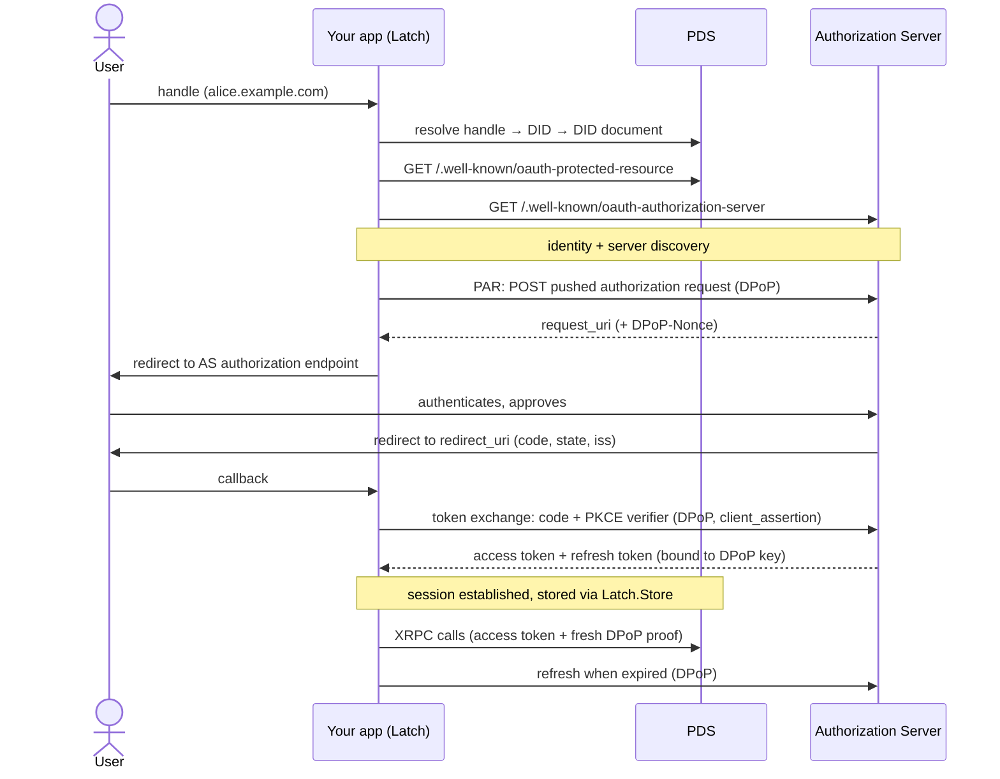

# Latch [](https://hex.pm/packages/latch) [](https://hexdocs.pm/latch/)

atproto OAuth and client library attempting to follow the specification strictly, while also following Elixir library guidelines. The goal is for the library to be easy to use and not get in your way, but fully flexible. Use it to build atproto based apps where users can log in with their atproto accounts from existing services like Bluesky, Blacksky or Eurosky.

It comes with DPoP nonce caching built-in, which cuts down on round-trips over multiple requests, and supports `:confidential`, `:public`, and `:localhost` client modes. You can run multiple instances of Latch, adding them to your supervision tree or starting them ad-hoc, including in tests.

## Installation

```elixir
def deps do
  [
    {:latch, "~> 0.7.0"}
  ]
end
```

<!-- MDOC !-->

## Get started

### What you need

1. If you're going to share your application online, you're going to need a public HTTPS URL for it. Authorization servers need to access your server over HTTPS. For local development, use `mode: :localhost`. Alternatively, use a service like https://cimd-service.fly.dev/ to host your client metadata for you.
2. Most backend applications will want to run in `mode: :confidential` in which case they need an ES256 (P-256) private JWK, encoded as JSON. Generate one and store it somewhere safe, it's a secret, treat it like a password.
       mix run -e '{_, jwk} = JOSE.JWK.to_map(JOSE.JWK.generate_key({:ec, "P-256"})); IO.puts(Jason.encode!(jwk))'

       export ATPROTO_CLIENT_PRIVATE_JWK='{"kty":"EC",...}'
3. Expose the client metadata and an OAuth callback URL on your site, that's `:client_id` and `:redirect_uri`.
4. A `Latch.Store` implementation. You can write your own, or use the built-in ETS implementation.

### Setting it up

Using the built-in ETS `Store` implementation, create your module like:

    defmodule MyApp.LatchStore do
      use Latch.Store.ETS
    end

Add `Latch` to your supervision tree, giving it a unique name and a `Latch.Store` implementation:

    children = [
      {MyApp.LatchStore, []},
      {Latch,
        name: MyApp.Latch,
        mode: :confidential,
        store: MyApp.LatchStore,
        client_id_path: "/oauth-client-metadata.json",
        redirect_uri_path: "/auth/callback",
        # Dynamically resolve the base URL at runtime, or pass a hard-coded URL
        base_url_fun: &MyApp.Endpoint.url/0,
        scope: "atproto",
        signing_key: System.fetch_env!("ATPROTO_CLIENT_PRIVATE_JWK")}
    ]

`signing_key` is the JWK from step 2 above. Optional keys: `:client_name`, `:client_uri` and `request_ttl`. Instead of using the built-in ETS Store implementation you can create your own, implementing the `Latch.Store` behavior.

You need to set up a route to serve the client metadata, matching the configuration `/oauth-client-metadata.json`.

    def client_metadata(conn, _params) do
      json(conn, Latch.client_metadata(MyApp.Latch))
    end

### Login flow

1. `authorize/2` resolves the handle, pushes the authorization request, and returns the URL to redirect the browser to.

       {:ok, url} = Latch.authorize(MyApp.Latch, "alice.bsky.social")

2. The user authorizes, and their authorization server redirects back to your `redirect_uri`.
3. `callback/2` validates the callback params, exchanges the code, and stores the session for you. Returns identity information:

       {:ok, %{did: did, handle: handle}} = Latch.callback(MyApp.Latch, conn.params)

The session is stored keyed by `did` — that `did` is all you need for authenticated calls. When a user logs out, call `delete_session`:

    :ok = Latch.delete_session(MyApp.Latch, did)

### Make authenticated requests

Calls go to the user's PDS, and access tokens are refreshed automatically:

    {:ok,
      %{
        "uri" => "at://did:plc:abc123/app.bsky.feed.post/3k2...",
        "cid" => "bafyreid...",
        "value" => %{
          "$type" => "app.bsky.feed.post",
          "text" => "Hello atproto",
          "createdAt" => "2026-07-31T12:00:00.000Z"
        }
      }} =
      Latch.query(MyApp.Latch, did, "com.atproto.repo.getRecord",
        params: [
          repo: did,
          collection: "app.bsky.feed.post",
          rkey: "3k2..."
        ]
      )

    {:ok,
      %{
        "uri" => "at://did:plc:abc123/app.bsky.feed.post/3k5...",
        "cid" => "bafyreig..."
      }} =
      Latch.procedure(MyApp.Latch, did, "com.atproto.repo.createRecord", %{
        repo: did,
        collection: "app.bsky.feed.post",
        record: %{text: "Hello atproto", createdAt: DateTime.utc_now()}
      })

## Service auth

Latch supports service auth through PDS proxying, by passing `service` as an option to a client call, like this:

    {:ok, %{"count" => 4}} =
      Latch.query(MyApp.Latch, did, "app.bsky.notification.getUnreadCount",
        service: "did:web:api.bsky.app#bsky_appview"
      )

Alternatively, you can fetch a short-lived service auth token and pass it as a bearer token, following the documentation [here](https://docs.bsky.app/docs/advanced-guides/service-auth). Here's an example for uploading a video to Bluesky, which does not support PDS proxying.

    # grab the pds_endpoint from the user's session
    aud = "did:web:" <> URI.parse(pds_endpoint).host

    {:ok, %{"token" => jwt}} =
      Latch.query(MyApp.Latch, did, "com.atproto.server.getServiceAuth",
        params: [
          aud: aud,
          lxm: "com.atproto.repo.uploadBlob",
          exp: System.system_time(:second) + 30 * 60
        ]
      )

    Req.post("https://video.bsky.app/xrpc/app.bsky.video.uploadVideo",
      headers: [{"authorization", "Bearer " <> jwt}, {"content-type", "video/mp4"}],
      params: [did: did, name: filename],
      body: video_bytes
    )

## Errors

Public functions return `{:error, exception}` tuples and will not normally raise on errors. See `Latch.Error` for more information.

## Diagram of the OAuth flow



## On correctness

> Postel's law: conservative in what you send, liberal in what you accept.

The library attempts to follow the spec strictly, but primarily in what the library itself does, and less strictly in what it accepts as long as it's not a security issue.

<!-- MDOC !-->

## Roadmap

- [x] Confidential client
- [x] DPoP nonce caching
- [x] Public client
- [x] Local client
- [x] Built-in ETS LatchStore implementation
- [x] TID, NSID, AtURI, DID, Handle
- [x] Service auth
- [ ] Unauthed client requests
- [ ] Getting started guide
- [ ] Extensive tests
- [ ] Distributed nonce cache

## Specification references

* https://docs.bsky.app/docs/advanced-guides/oauth-client
* https://atproto.com/specs/oauth
